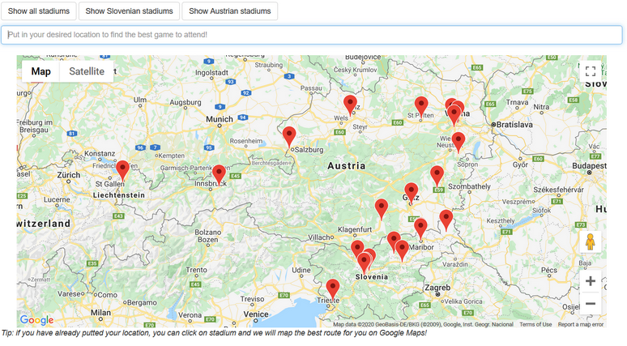
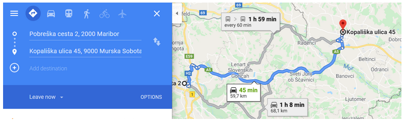
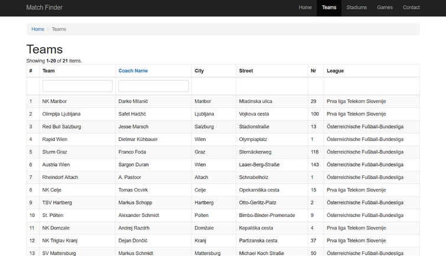
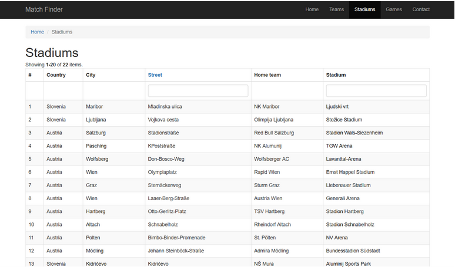
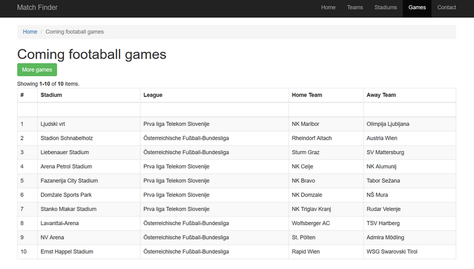
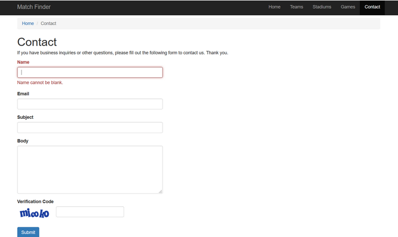

# MatchFinder
Becis idea: 
Web & mobile app will help user to find the nearest stadium and the match.

User will be able to get information about the matches, stadium location, football team names. App will recommend the best games for user based on teams rankings and distance between user and stadium. Our application will use the user's location and it will display near matches places on the map.

## Web site
Web site can be accessible at matchfinder.pl. All data can be found on server: http://serwer1971603.home.pl​.
Web site main page is responsible for presenting most interesting football match for user, based on algorithm taking into account distance from user and match attractiveness. Maribor was chosen as default user location. After choosing new place on the search bar new match is calculated.

  

Most relevant football game for Villach.

  

Stadiums can be shown by clicking one of 3 buttons placed above search bar.

  

If user location is already provided, stadium can be clicked and Google maps will be opened in new window with directions to desired stadium. 

  

Teams, Stadiums and Game sites provide all teams, stadiums and football games available in the database. 

  

  

  

Contact site, needs some configuration. We did not manage to provide working back end on time. 

  

Paweł Tomaszewski:
* Buying, setting up and maintaining web server and domain.
* Connecting and setting up framework yii2.
* MVC accomplished by yii2 features (model, crud generator)
* Connecting to google maps api, creating working map and search bar.
* Configuring account on phpMyAdmin for data base.
* Connecting to data base, writing a few models for obtaining data.
* Creating few controllers for Stadiums, Teams, Games and general site controller. 
* Writing yii queries in search models for passing data from data base, through controllers to views.
* Displaying stadiums on map by 3 buttons (java script).
* Allowing user clicking on stadium he want to visit and opening for him directions on Google maps.
* Writing code for Games, Teams and Stadiums views, using gridView provided by yii2.
* Setting assets folder with scaled photo ready to put on the website in the future.  
* Configuring contact form, setting up mailing post on server (not finished)
* Putting stadiums names into the data base.
* Styling everything using bootstrap
* Putting all files on web server and making it work 

Jakub Głatki:
* Projecting database in MySQL workbench, creating it, writing triggers
* Moving database to phpmyadmin
* writing procedures for fulfilling database
* adding games to database
* Working with SportsMonk api (not finished)
* Connecting database to website using PHP
* Implementing algorithm for finding the best game for user using PHP
* Adjusting methods for showing data about all teams after changing location, using JavaScript
* Adjusting website design using HTML and CSS

Mateusz Piwowarski:
* Application

Carolina Alves and Ipek Bengisu Aydemir:
* Design
### Future goals:
* Adding algorithm for projecting goals in the game
* Adding algorithm for projecting team future form
* Adding swiping on option on web page to jump by web sites by arrows button
* Secure our API key for website. Key shouldn't be in code/any public place.
* Connect to football api, to fulfill our data base in real time.

Team:
1. Mateusz Piwowarski
2. Carolina Alves 
3. Viktor Angelovski
4. Jakub Glatki
5. Pawel Tomaszewski
6. Ipek Bengisu Aydemir
